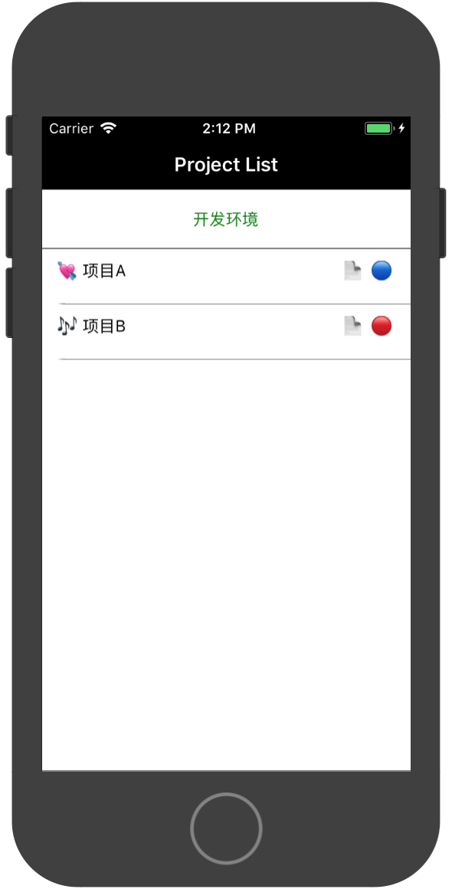

# opsPM

## init

```bash
# react-native init opsPM
# cd opsPM
```

copy the source code from `App.js` and `css.js`

then run the demo on your simulator or device:
```bash
# react-native run-ios
```

## snapshots



